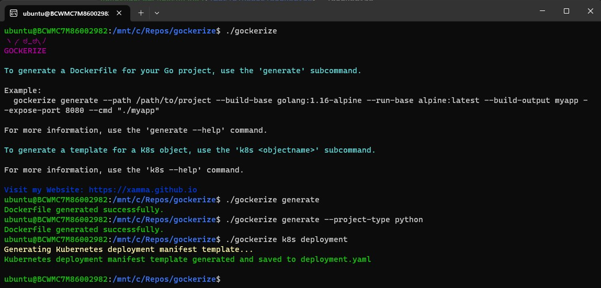

# Gockerize - Build Dockerfiles for you Go projects
[](https://github.com/xamma/gockerize/actions/workflows/build-and-release.yaml)  

This project is a very simple CLI tool for creating Dockerfiles for Go and Python projects.  
It also lets you create Templates for Kubernetes-Objects.  


  
**Important**: It only uses the same template-structure and may need to be adjusted according to your needs and projects.  
I primarly made this for learning how to write CLI tools with the **Cobra library in Go**.  

## How to install
Download the binary and execute it. Make sure to have the right permissions as well as the right operating system.  
```
curl -LO https://github.com/xamma/gockerize/releases/download/<VERSION>/gockerize-linux-amd64
sudo mv gockerize-linux-amd64 /usr/local/bin/gockerize
sudo chmod +x /usr/local/bin/gockerize
```

## How to run
For creating Dockerfiles:
```
gockerize generate
```
It will print if successful and output the Dockerfile in the current dir.  

If you want to create Kubernetes manifests for different objects run:
```
gockerize k8s <objectname>
```

## Where it works
I tested it on this common project layout, and it will work on similar layouts.  
```
├── Dockerfile
├── LICENSE.md
├── Readme.md
├── config
│   └── config.go
├── database
│   ├── db.go
│   └── item_db.go
├── docs
│   ├── docs.go
│   ├── swagger.json
│   └── swagger.yaml
├── go.mod
├── go.sum
├── handlers
│   └── item_handlers.go
├── main.go
└── models
    ├── appconfig.go
    └── item.go
```
For the Python Dockerfiles you NEED to have an requirements.txt. It will search for it in the directory.  

## Build from source
Clone repo and cd into it. Run ```go build```.  

## CI/CD
The GitHub Actions Workflow builds the Tool for Ubuntu & Windows and creates the release.